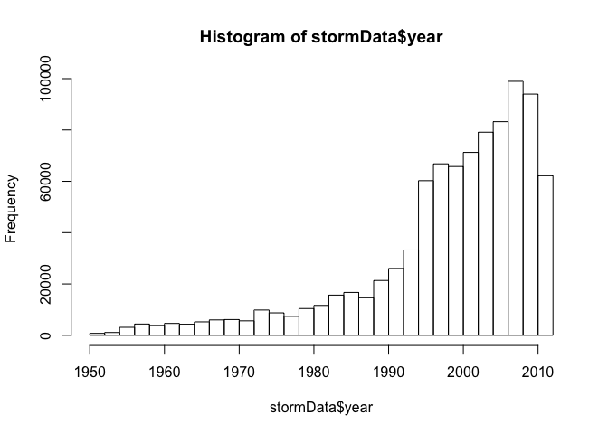
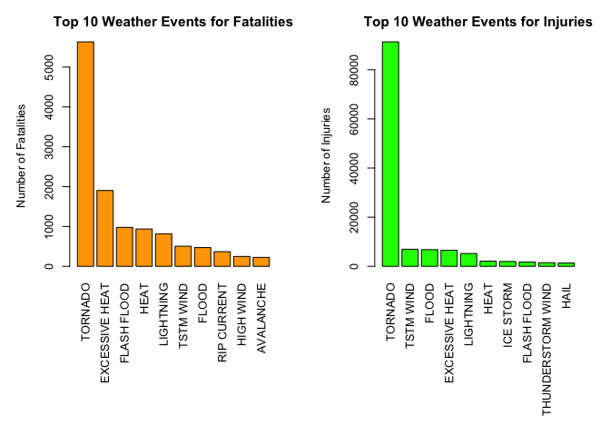
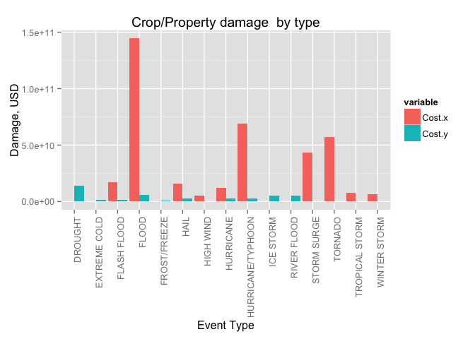

# Reproducible Research: Peer Assignment 2
Vimala Venugopalan-Mark  
August 11, 2015  

#Synopsis

This report will analyze how storms and severe weather events can cause problems in public health and ecomonic problems for communities and muncipalities.  Many of these storm events can result  fatalities, injuries, and property damage, and preventing such outcomes to the extent possible is a key concern.

This project involves exploring the U.S. National Oceanic and Atmospheric Administration’s (NOAA) storm database. This database tracks characteristics of major storms and weather events in the United States, including when and where they occur, as well as estimates of any fatalities, injuries, and property damage.

We will be exploring the NOAA Storm Database to answer the following questions related to weather events from the year 1990 through 2011 :

* Across the United States, which types of events are most harmful with respect to population health?
* Across the United States, which types of events have the greatest economic consequences?
During the analysis it was found that the most harmful event is the tornado causing with 5633 deaths and 91346 injuries. In terms of economical loses, floods has been the responsible of most of the properties loses, while drought has been the greater contributor to crops loses.


```r
echo="TRUE"
options(scipen = 1)  
library(R.utils)
```

```
## Loading required package: R.oo
## Loading required package: R.methodsS3
## R.methodsS3 v1.7.0 (2015-02-19) successfully loaded. See ?R.methodsS3 for help.
## R.oo v1.19.0 (2015-02-27) successfully loaded. See ?R.oo for help.
## 
## Attaching package: 'R.oo'
## 
## The following objects are masked from 'package:methods':
## 
##     getClasses, getMethods
## 
## The following objects are masked from 'package:base':
## 
##     attach, detach, gc, load, save
## 
## R.utils v2.1.0 (2015-05-27) successfully loaded. See ?R.utils for help.
## 
## Attaching package: 'R.utils'
## 
## The following object is masked from 'package:utils':
## 
##     timestamp
## 
## The following objects are masked from 'package:base':
## 
##     cat, commandArgs, getOption, inherits, isOpen, parse, warnings
```

```r
library(ggplot2)
library(plyr)
require(gridExtra)
```

```
## Loading required package: gridExtra
```

#Data Processing

Downloading and unzipping storm data from U.S. National Ocenaic and Atmoshpheric Adminsitration database


```r
setwd("~/Documents/DataAnalysis/ReproducibleResearch")

if (!file.exists("StormData.csv.bz2")) {
    fileURL <- 'https://d396qusza40orc.cloudfront.net/repdata%2Fdata%2FStormData.csv.bz2'
    download.file(fileURL, destfile='StormData.csv.bz2', method = 'curl')
}
stormData <- read.csv(bzfile('StormData.csv.bz2'),header=TRUE, stringsAsFactors = FALSE)
downloadedData <- date()
```


## Analysis Storm Data information 

Displaying some basic analysis on Storm Information from the data frame stormData


```r
stormColData <- dim(stormData)[2]
stormRowData <- dim(stormData)[1]

print (sprintf("There are %d rows and %d columns in the Storm data set. The events in the database start in the year 1950 and end in November 2011. In the earlier years of the database there are generally fewer events recorded, most likely due to a lack of reliable/complete records.", stormRowData, stormColData) )
```

```
## [1] "There are 902297 rows and 37 columns in the Storm data set. The events in the database start in the year 1950 and end in November 2011. In the earlier years of the database there are generally fewer events recorded, most likely due to a lack of reliable/complete records."
```

```r
summary (stormData)
```

```
##     STATE__       BGN_DATE           BGN_TIME          TIME_ZONE        
##  Min.   : 1.0   Length:902297      Length:902297      Length:902297     
##  1st Qu.:19.0   Class :character   Class :character   Class :character  
##  Median :30.0   Mode  :character   Mode  :character   Mode  :character  
##  Mean   :31.2                                                           
##  3rd Qu.:45.0                                                           
##  Max.   :95.0                                                           
##                                                                         
##      COUNTY       COUNTYNAME           STATE              EVTYPE         
##  Min.   :  0.0   Length:902297      Length:902297      Length:902297     
##  1st Qu.: 31.0   Class :character   Class :character   Class :character  
##  Median : 75.0   Mode  :character   Mode  :character   Mode  :character  
##  Mean   :100.6                                                           
##  3rd Qu.:131.0                                                           
##  Max.   :873.0                                                           
##                                                                          
##    BGN_RANGE          BGN_AZI           BGN_LOCATI       
##  Min.   :   0.000   Length:902297      Length:902297     
##  1st Qu.:   0.000   Class :character   Class :character  
##  Median :   0.000   Mode  :character   Mode  :character  
##  Mean   :   1.484                                        
##  3rd Qu.:   1.000                                        
##  Max.   :3749.000                                        
##                                                          
##    END_DATE           END_TIME           COUNTY_END COUNTYENDN    
##  Length:902297      Length:902297      Min.   :0    Mode:logical  
##  Class :character   Class :character   1st Qu.:0    NA's:902297   
##  Mode  :character   Mode  :character   Median :0                  
##                                        Mean   :0                  
##                                        3rd Qu.:0                  
##                                        Max.   :0                  
##                                                                   
##    END_RANGE          END_AZI           END_LOCATI       
##  Min.   :  0.0000   Length:902297      Length:902297     
##  1st Qu.:  0.0000   Class :character   Class :character  
##  Median :  0.0000   Mode  :character   Mode  :character  
##  Mean   :  0.9862                                        
##  3rd Qu.:  0.0000                                        
##  Max.   :925.0000                                        
##                                                          
##      LENGTH              WIDTH                F               MAG         
##  Min.   :   0.0000   Min.   :   0.000   Min.   :0.0      Min.   :    0.0  
##  1st Qu.:   0.0000   1st Qu.:   0.000   1st Qu.:0.0      1st Qu.:    0.0  
##  Median :   0.0000   Median :   0.000   Median :1.0      Median :   50.0  
##  Mean   :   0.2301   Mean   :   7.503   Mean   :0.9      Mean   :   46.9  
##  3rd Qu.:   0.0000   3rd Qu.:   0.000   3rd Qu.:1.0      3rd Qu.:   75.0  
##  Max.   :2315.0000   Max.   :4400.000   Max.   :5.0      Max.   :22000.0  
##                                         NA's   :843563                    
##    FATALITIES          INJURIES            PROPDMG       
##  Min.   :  0.0000   Min.   :   0.0000   Min.   :   0.00  
##  1st Qu.:  0.0000   1st Qu.:   0.0000   1st Qu.:   0.00  
##  Median :  0.0000   Median :   0.0000   Median :   0.00  
##  Mean   :  0.0168   Mean   :   0.1557   Mean   :  12.06  
##  3rd Qu.:  0.0000   3rd Qu.:   0.0000   3rd Qu.:   0.50  
##  Max.   :583.0000   Max.   :1700.0000   Max.   :5000.00  
##                                                          
##   PROPDMGEXP           CROPDMG         CROPDMGEXP       
##  Length:902297      Min.   :  0.000   Length:902297     
##  Class :character   1st Qu.:  0.000   Class :character  
##  Mode  :character   Median :  0.000   Mode  :character  
##                     Mean   :  1.527                     
##                     3rd Qu.:  0.000                     
##                     Max.   :990.000                     
##                                                         
##      WFO             STATEOFFIC         ZONENAMES            LATITUDE   
##  Length:902297      Length:902297      Length:902297      Min.   :   0  
##  Class :character   Class :character   Class :character   1st Qu.:2802  
##  Mode  :character   Mode  :character   Mode  :character   Median :3540  
##                                                           Mean   :2875  
##                                                           3rd Qu.:4019  
##                                                           Max.   :9706  
##                                                           NA's   :47    
##    LONGITUDE        LATITUDE_E     LONGITUDE_       REMARKS         
##  Min.   :-14451   Min.   :   0   Min.   :-14455   Length:902297     
##  1st Qu.:  7247   1st Qu.:   0   1st Qu.:     0   Class :character  
##  Median :  8707   Median :   0   Median :     0   Mode  :character  
##  Mean   :  6940   Mean   :1452   Mean   :  3509                     
##  3rd Qu.:  9605   3rd Qu.:3549   3rd Qu.:  8735                     
##  Max.   : 17124   Max.   :9706   Max.   :106220                     
##                   NA's   :40                                        
##      REFNUM      
##  Min.   :     1  
##  1st Qu.:225575  
##  Median :451149  
##  Mean   :451149  
##  3rd Qu.:676723  
##  Max.   :902297  
## 
```

```r
head (stormData)
```

```
##   STATE__           BGN_DATE BGN_TIME TIME_ZONE COUNTY COUNTYNAME STATE
## 1       1  4/18/1950 0:00:00     0130       CST     97     MOBILE    AL
## 2       1  4/18/1950 0:00:00     0145       CST      3    BALDWIN    AL
## 3       1  2/20/1951 0:00:00     1600       CST     57    FAYETTE    AL
## 4       1   6/8/1951 0:00:00     0900       CST     89    MADISON    AL
## 5       1 11/15/1951 0:00:00     1500       CST     43    CULLMAN    AL
## 6       1 11/15/1951 0:00:00     2000       CST     77 LAUDERDALE    AL
##    EVTYPE BGN_RANGE BGN_AZI BGN_LOCATI END_DATE END_TIME COUNTY_END
## 1 TORNADO         0                                               0
## 2 TORNADO         0                                               0
## 3 TORNADO         0                                               0
## 4 TORNADO         0                                               0
## 5 TORNADO         0                                               0
## 6 TORNADO         0                                               0
##   COUNTYENDN END_RANGE END_AZI END_LOCATI LENGTH WIDTH F MAG FATALITIES
## 1         NA         0                      14.0   100 3   0          0
## 2         NA         0                       2.0   150 2   0          0
## 3         NA         0                       0.1   123 2   0          0
## 4         NA         0                       0.0   100 2   0          0
## 5         NA         0                       0.0   150 2   0          0
## 6         NA         0                       1.5   177 2   0          0
##   INJURIES PROPDMG PROPDMGEXP CROPDMG CROPDMGEXP WFO STATEOFFIC ZONENAMES
## 1       15    25.0          K       0                                    
## 2        0     2.5          K       0                                    
## 3        2    25.0          K       0                                    
## 4        2     2.5          K       0                                    
## 5        2     2.5          K       0                                    
## 6        6     2.5          K       0                                    
##   LATITUDE LONGITUDE LATITUDE_E LONGITUDE_ REMARKS REFNUM
## 1     3040      8812       3051       8806              1
## 2     3042      8755          0          0              2
## 3     3340      8742          0          0              3
## 4     3458      8626          0          0              4
## 5     3412      8642          0          0              5
## 6     3450      8748          0          0              6
```

```r
names (stormData)
```

```
##  [1] "STATE__"    "BGN_DATE"   "BGN_TIME"   "TIME_ZONE"  "COUNTY"    
##  [6] "COUNTYNAME" "STATE"      "EVTYPE"     "BGN_RANGE"  "BGN_AZI"   
## [11] "BGN_LOCATI" "END_DATE"   "END_TIME"   "COUNTY_END" "COUNTYENDN"
## [16] "END_RANGE"  "END_AZI"    "END_LOCATI" "LENGTH"     "WIDTH"     
## [21] "F"          "MAG"        "FATALITIES" "INJURIES"   "PROPDMG"   
## [26] "PROPDMGEXP" "CROPDMG"    "CROPDMGEXP" "WFO"        "STATEOFFIC"
## [31] "ZONENAMES"  "LATITUDE"   "LONGITUDE"  "LATITUDE_E" "LONGITUDE_"
## [36] "REMARKS"    "REFNUM"
```

The histogram will display a breakdown of storm data by year.


```r
if (stormColData == 37) {
    stormData$year <- as.numeric(format(as.Date(stormData$BGN_DATE, format = "%m/%d/%Y %H:%M:%S"), "%Y"))
}

hist(stormData$year, breaks=30)
```

 

Based on the histgram above,  the number of events between 1950 to 1980 is relatively small compared to the period 1990 to 2011.  We will consider the period 1990 through 2011 as best track record period in the data set.

From all the columns only several of them will be relevant to our analysis.  There are the following columns.
        * EVTYPE        : the type weather event
        * FATALITIES    : the number of fatalities
        * INJURIES      : the number of injuries
        * PROPDMG       : the amount of property damage in US dollars
        * PROPDMGEXP    : a multiplier got PROPDMG 
        * CROPDMG       : the amount of crop damage in US dollars
        * CROPDMGEXP:      : a multiplier for CROPDMG


```

## Comparing the economic variable impact with Property Damage and Crop Damage

The values of property damage (PROPDMG) and crops (CROPDMG) are related to PROPDMGEXP and CROPDMGEXP variables, in this way: B ( bilion), h or H (houndre), K (kilo), m or M (million).  For the crop and property damage for between the years 1990 through 2011.

The property damage values (TOTALPROPDMG contains to total property damage cost)


```r
stormData$PROPDMGEXP <- as.character(stormData$PROPDMGEXP)
stormData$PROPDMGEXP[toupper(stormData$PROPDMGEXP) == 'H'] <- "2"
stormData$PROPDMGEXP[toupper(stormData$PROPDMGEXP) == 'K'] <- "3"
stormData$PROPDMGEXP[toupper(stormData$PROPDMGEXP) == 'M'] <- "6"
stormData$PROPDMGEXP[toupper(stormData$PROPDMGEXP) == 'B'] <- "9"
stormData$PROPDMGEXP <- as.numeric(stormData$PROPDMGEXP)
```

```
## Warning: NAs introduced by coercion
```

```r
stormData$PROPDMGEXP[is.na(stormData$PROPDMGEXP)] <- 0
stormData$TOTALPROPDMG <- stormData$PROPDMG * 10^stormData$PROPDMGEXP
```

The crop damage values (TOTALCROPDMG contains to total crop damage cost)


```r
stormData$CROPDMGEXP <- as.character(stormData$CROPDMGEXP)
stormData$CROPDMGEXP[toupper(stormData$CROPDMGEXP) == 'H'] <- "2"
stormData$CROPDMGEXP[toupper(stormData$CROPDMGEXP) == 'K'] <- "3"
stormData$CROPDMGEXP[toupper(stormData$CROPDMGEXP) == 'M'] <- "6"
stormData$CROPDMGEXP[toupper(stormData$CROPDMGEXP) == 'B'] <- "9"
stormData$CROPDMGEXP <- as.numeric(stormData$CROPDMGEXP)
```

```
## Warning: NAs introduced by coercion
```

```r
stormData$CROPDMGEXP[is.na(stormData$CROPDMGEXP)] <- 0
stormData$TOTALCROPDMG <- stormData$CROPDMG * 10^stormData$CROPDMGEXP
```

## Results

### 1. Across the United States, which types of events (as indicated in the EVTYPE variable) are most harmful with respect to population health?

1.1  To present the results we will divide the data by fatalities and injuries.  Performing the aggregate function to obtain all fatalities by specific event and then taking the top 10 events in descending order.


```r
sumFatalities <- aggregate(stormData$FATALITIES, by = list(stormData$EVTYPE), "sum")
names(sumFatalities) <- c("Event", "Fatalities")
sumFatalities <- sumFatalities[order(-sumFatalities$Fatalities), ][1:10, ]
sumFatalities
```

```
##              Event Fatalities
## 834        TORNADO       5633
## 130 EXCESSIVE HEAT       1903
## 153    FLASH FLOOD        978
## 275           HEAT        937
## 464      LIGHTNING        816
## 856      TSTM WIND        504
## 170          FLOOD        470
## 585    RIP CURRENT        368
## 359      HIGH WIND        248
## 19       AVALANCHE        224
```

1.2 Performing the aggregate function to obtain all injuries by specific event and then taking the top 10 events in descending order.


```r
sumInjuries <- aggregate(stormData$INJURIES, by = list(stormData$EVTYPE), "sum")
names(sumInjuries) <- c("Event", "Injuries")
sumInjuries <- sumInjuries[order(-sumInjuries$Injuries), ][1:10, ]
sumInjuries
```

```
##                 Event Injuries
## 834           TORNADO    91346
## 856         TSTM WIND     6957
## 170             FLOOD     6789
## 130    EXCESSIVE HEAT     6525
## 464         LIGHTNING     5230
## 275              HEAT     2100
## 427         ICE STORM     1975
## 153       FLASH FLOOD     1777
## 760 THUNDERSTORM WIND     1488
## 244              HAIL     1361
```

1.3  Using a boxplot to graph the top 10 events by Fatalities and Injuries


```r
par(mfrow = c(1, 2), mar = c(12, 5, 3, 2), mgp = c(3, 1, 0), cex = 0.8, las = 3)
barplot(sumFatalities$Fatalities, names.arg = sumFatalities$Event, col = 'orange',
        main = 'Top 10 Weather Events for Fatalities', ylab = 'Number of Fatalities')
barplot(sumInjuries$Injuries, names.arg = sumInjuries$Event, col = 'green',
        main = 'Top 10 Weather Events for Injuries', ylab = 'Number of Injuries')
```

 

2. Across the United States, which types of events have the greatest economic consequences?

2.1  As with the approach to find the top 10 events for property and crop damages we will use the same approach for the economic consequences.

* Events that caused most cost in damage to properties


```r
sumPropDmg <- aggregate(stormData$TOTALPROPDMG, by = list(stormData$EVTYPE), "sum")
names(sumPropDmg) <- c("Event", "Cost")
sumPropDmg <- sumPropDmg[order(-sumPropDmg$Cost), ][1:10, ]
sumPropDmg
```

```
##                 Event         Cost
## 170             FLOOD 144657709807
## 411 HURRICANE/TYPHOON  69305840000
## 834           TORNADO  56947380676
## 670       STORM SURGE  43323536000
## 153       FLASH FLOOD  16822673978
## 244              HAIL  15735267513
## 402         HURRICANE  11868319010
## 848    TROPICAL STORM   7703890550
## 972      WINTER STORM   6688497251
## 359         HIGH WIND   5270046295
```

* Events that caused the most cost in damage to crops.


```r
sumCropDmg <- aggregate(stormData$TOTALCROPDMG, by = list(stormData$EVTYPE), "sum")
names(sumCropDmg) <- c("Event", "Cost")
sumCropDmg <- sumCropDmg[order(-sumCropDmg$Cost), ][1:10, ]
sumCropDmg
```

```
##                 Event        Cost
## 95            DROUGHT 13972566000
## 170             FLOOD  5661968450
## 590       RIVER FLOOD  5029459000
## 427         ICE STORM  5022113500
## 244              HAIL  3025954473
## 402         HURRICANE  2741910000
## 411 HURRICANE/TYPHOON  2607872800
## 153       FLASH FLOOD  1421317100
## 140      EXTREME COLD  1292973000
## 212      FROST/FREEZE  1094086000
```

2.2 


```r
library(reshape2)
library(ggplot2)
fatalitiesAndDamage <- merge(x = sumPropDmg, y = sumCropDmg, by = "Event", all = TRUE)
fatalitiesAndDamage <- melt(fatalitiesAndDamage, id.vars = 'Event')
ggplot(fatalitiesAndDamage, aes(Event, value)) +   
        geom_bar(aes(fill = variable), position = "dodge", stat="identity") +
        theme(axis.text.x = element_text(angle = 90, hjust = 1)) + xlab("Event Type") + 
        ylab("Damage, USD") + ggtitle("Crop/Property damage  by type")
```

 

Based on the histograms above, we find that flood and hurricane/typhoon cause most property damage; drought and flood causes most crop damage in the United States from 1950 to 2011.

##Conclusion

From these data, we found that excessive heat and tornado are most harmful with respect to population health, while flood, drought, and hurricane/typhoon have the greatest economic impact.
